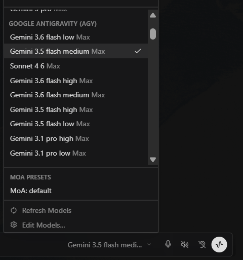
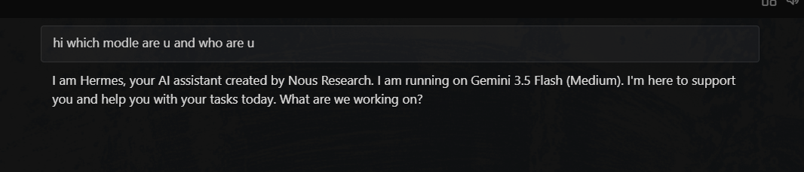

# hermes-antigravity-provider

Run Google Antigravity models inside [Hermes Agent](https://github.com/NousResearch/hermes-agent) through the official `agy` CLI.

Claude Sonnet 4.6, Claude Opus 4.6, the Gemini 3.x line and GPT-OSS 120B, with streaming, multi-turn conversations and function calling — registered as an ordinary Hermes provider.





---

## How it works, in one paragraph

Hermes speaks HTTP. `agy` is a command-line program. This package runs a small
OpenAI-compatible server on loopback that translates one into the other: it
turns `chat/completions` requests into `agy` invocations, parses the NDJSON that
comes back, and hands Hermes a normal streaming response. `agy` does its own
OAuth and keeps its own token, so no credential is ever handled here.

## What this does not do

- **Never touches your OAuth token.** `agy auth login` is the only login path, and `agy` holds the credential.
- **No client impersonation.** No borrowed OAuth client id, no forged `userAgent`, no Antigravity version headers.
- **No device fingerprints.** No randomised platform, architecture or device id.
- **No multi-account rotation.** One account, no quota pooling.
- **No patches to Hermes.** Everything installs as a plugin plus one config entry.

Every request is made by the official client, with the identity it normally
sends. If you want fingerprint spoofing or account rotation to stretch the free
tier, this is the wrong repository — and worth knowing that Google enforces at
the backend layer, where a ban can reach the whole Google account, Gmail and
Drive included.

**A judgement call that is yours, not this README's:** Antigravity is a consumer
product with a free tier, and this automates it. Whether that fits Google's
terms for your account is for you to decide.

## Requirements

| | |
| --- | --- |
| `agy` CLI | v1.1.12 or newer, on `PATH` or pointed at by `HERMES_ANTIGRAVITY_COMMAND` |
| A logged-in `agy` | `agy auth login`, once |
| Python | 3.10+ |
| Hermes Agent | any version with user model-provider plugin discovery |

Check the first two before anything else — nothing below works until this does:

```bash
agy models
```

## Install

Commands use `python -m hermes_antigravity`. A `hermes-antigravity` console
script is installed too, but its directory is often not on `PATH`.

**1. Install the package.**

```bash
pip install git+https://github.com/Aryan-Pardeshi/hermes-antigravity-provider.git
```

**2. Run setup.** This installs two `agy` agents and declares the provider in
Hermes's `config.yaml`. Both are required — see [Why two agents](#why-two-agents)
and [Why config.yaml](#why-configyaml).

```bash
python -m hermes_antigravity setup
```

**3. Copy the provider plugin** into your Hermes home. It is usually *not*
`~/.hermes` — on Windows it defaults to `%LOCALAPPDATA%\hermes`.

```bash
HH="${HERMES_HOME:-$HOME/.hermes}"
mkdir -p "$HH/plugins/model-providers"
cp -r plugins/model-providers/antigravity "$HH/plugins/model-providers/"
```

```powershell
$HH = if ($env:HERMES_HOME) { $env:HERMES_HOME } else { "$env:LOCALAPPDATA\hermes" }
New-Item -ItemType Directory -Force "$HH\plugins\model-providers"
Copy-Item -Recurse plugins\model-providers\antigravity "$HH\plugins\model-providers\"
```

**4. Enable it.** Hermes discovers user plugins but does not enable them. When
asked about tool-override permission, answer **no** — this provider declares an
inference backend and never needs to intercept tools.

```bash
hermes plugins enable antigravity
```

**5. Verify.**

```bash
python -m hermes_antigravity doctor
```

```
[ok]   agy binary: /path/to/agy
[ok]   agy login: 11 models available
[ok]   agent hermes-passthrough
[ok]   agent hermes-reader
[ok]   config.yaml declares the provider
[ok]   hermes CLI: /path/to/hermes
```

**6. Use it.**

```bash
hermes -z "Reply with exactly the word PONG." --provider antigravity -m gemini-3.6-flash-low
```

The bridge starts itself on first use, and the placeholder credential Hermes
requires is set by the plugin. **For the desktop app**, set that credential
persistently — the GUI reads it from the environment it was launched in — then
restart the app:

```powershell
setx HERMES_ANTIGRAVITY_API_KEY local-bridge
```

## Design notes

Everything below was measured against `agy` 1.1.12 on Windows 11, not assumed.

### Why two agents

Left alone, `agy` injects its own system prompt plus roughly fifty tool
definitions into every call. Running under an agent declared with `tools: []`
removes them:

| Request | Default agent | `hermes-passthrough` |
| --- | --- | --- |
| `Say exactly: PONG` | 23,684 input tokens | 5,398 |
| Weather question, one tool declared | 23,357 | 5,805 |

`hermes-reader` is the same idea with a single file-read tool, used only for
prompts too large for argv.

Neither agent claims an identity. They defer to the prompt's system message and
are told explicitly not to introduce themselves as Antigravity, Gemini or
Claude — an agent asserting its own persona would fight Hermes's.

### Why config.yaml

Hermes resolves providers through two unrelated paths. Inference uses
`providers/_discover_providers()`, which scans the plugin directory. Model
*switching* uses `resolve_provider_full()` in `hermes_cli/providers.py`, whose
chain is the built-in table, then models.dev, then `config.yaml` — it never
consults the plugin registry.

A plugin-only install therefore works from the CLI and fails in the desktop app
with `Unknown provider 'antigravity'` the moment you switch models. `setup`
writes this, backing up to `config.yaml.bak-antigravity` first:

```yaml
providers:
  antigravity:
    name: Google Antigravity (agy)
    api: http://127.0.0.1:8787/v1
    key_env: HERMES_ANTIGRAVITY_API_KEY
    transport: openai_chat
```

### Function calling

`agy` has no flag for a tool specification. The OpenAI `tools` array is rendered
into the prompt, and the JSON reply is parsed back into `tool_calls` with
`finish_reason: "tool_calls"`.

`agy` does have `--json-schema`, which enforces output shape and returns a
parsed `structured_output` — the obvious mechanism, and deliberately unused.
Passing it makes `agy` ignore `--agent` and fall back to its default agent,
which restores the ~23k token overhead *and* re-exposes its own toolset: asked
for weather with a `get_weather` function declared, it called its built-in
`search_web` instead. Under the no-tool agent those tools do not exist.

### Long prompts

`agy` takes its prompt as one argv entry, and every OS caps how long a single
argument can be:

- **Linux** — `MAX_ARG_STRLEN`, 32 pages / 131,072 bytes, *per string*. The ~2 MB `ARG_MAX` figure is the total for argv plus environment, so a long prompt trips the per-string cap first.
- **Windows** — `CreateProcess` caps the whole command line at 32,767 characters. Measured: a single argument of 32,700 bytes passes, 32,750 fails.

Environment variables are not a way around it — `execve(2)` applies the same
per-string cap to environment entries.

Oversized prompts are written into a fresh directory, handed to `agy` with
`--add-dir`, and argv carries a short pointer. Verified with a 63,106-byte
prompt. The file leads with its instructions; without that header a 60 KB prompt
came back as echoed source text.

A real Hermes request is around 34,000 characters, so **ordinary traffic takes
this path**, not argv. That is the design working, not a fault.

### Identity and memory

Hermes sends a ~34,000 character system message carrying its identity, the
instruction to identify as Hermes rather than the underlying model, and the
contents of `SOUL.md`, `memories/USER.md` and `memories/MEMORY.md`. All of it
passes through untouched.

Requests that arrive *without* a system message — `curl`, scripts, other
clients — would leave the model with no identity and no memory. Those get one
built from the same files under `$HERMES_HOME`, plus the skill names in
`$HERMES_HOME/skills/`, each file capped at 8,000 characters. This never fires
on the Hermes path.

### Multi-turn

The first request sends the whole conversation. `agy` returns a
`conversation_id`, replayed with `--conversation` on later turns so history is
not resent.

## Performance

A trivial prompt takes about 17.7s end to end:

| Phase | Time |
| --- | --- |
| `agy` binary startup | 0.24s |
| Until `agy` emits its first event | ~10.1s |
| Until the first token | ~16.5s |
| Total | ~17.7s |

**Most of that is not reachable from here.** The ~10s is `agy`'s own session
setup. `--sandbox` costs nothing (18.4s against 18.8s), and resuming a
conversation saves about 1s (17.6s to 16.6s).

Two things this package does:

- **The model list is cached** for 15 minutes. `agy models` costs ~5s and Hermes calls `/v1/models` every time the picker opens; a cache hit returns in ~10 microseconds. It also absorbs stalls — one call during testing hung past 60s, which would otherwise have emptied the picker.
- **Streaming is real.** Deltas are forwarded as `agy` produces them. On a 120-word answer, first visible text moved from 19.95s to 17.95s, and the gap grows with length. Requests declaring tools stay buffered, since a tool call is not decidable until the reply completes.

Expect **15-20s for a short answer**, plus a ~5k input-token floor per request.
That is `agy`'s floor, not overhead added here.

## Configuration

| Variable | Purpose | Default |
| --- | --- | --- |
| `HERMES_ANTIGRAVITY_API_KEY` | Placeholder credential; any non-empty value | set to `local-bridge` by the plugin |
| `HERMES_ANTIGRAVITY_BASE_URL` | Where the provider expects the bridge | `http://127.0.0.1:8787/v1` |
| `HERMES_ANTIGRAVITY_COMMAND` | Path to the `agy` binary | found on `PATH` |
| `AGY_CLI_PATH` | Alternate path variable, checked second | — |
| `HERMES_ANTIGRAVITY_PYTHON` | Interpreter used to start the bridge | `sys.executable`, then `PATH` |
| `HERMES_ANTIGRAVITY_NO_AUTOSTART` | Any non-empty value disables bridge autostart | unset |
| `HERMES_ANTIGRAVITY_NO_CONTEXT` | Any non-empty value disables the identity fallback | unset |
| `HERMES_HOME` | Where Hermes keeps `SOUL.md`, `memories/`, `skills/` | `%LOCALAPPDATA%\hermes`, else `~/.hermes` |

### Commands

```bash
python -m hermes_antigravity setup     # install agy agents + declare in config.yaml
python -m hermes_antigravity config    # declare in config.yaml only
python -m hermes_antigravity doctor    # check every prerequisite
python -m hermes_antigravity models    # list models agy offers
python -m hermes_antigravity serve     # run the bridge in the foreground
```

## Limitations

- **Sampling parameters are ignored.** `agy` exposes no `--temperature`, `--top-p`, `--max-tokens` or stop sequences. Hermes may send them; they have no effect. `reasoning_effort` of `low`/`medium`/`high` maps onto `--effort`.
- **~5k input-token floor** per request that `agy` adds and this cannot remove.
- **~15-20s latency** for a short answer, dominated by `agy` session setup.
- **Images are dropped** with a text placeholder — `agy` print mode is text-only.
- **Free-tier limits** are between you and Google. No retries, and deliberately no mechanism to spread load across accounts.
- **Not a native provider.** Hermes has a subprocess provider path (`auth_type="external_process"`, used by `copilot-acp`) but it speaks ACP over stdio, a different protocol from `agy`'s print mode. [NousResearch/hermes-agent#84057](https://github.com/NousResearch/hermes-agent/pull/84057) generalises the command resolution behind that path so it is no longer hardcoded to Copilot — a step toward removing the bridge.

## Troubleshooting

| Symptom | Cause and fix |
| --- | --- |
| `Unknown provider 'antigravity'` when switching models | Model switching reads only `config.yaml`. Run `python -m hermes_antigravity config`, then restart. |
| Works in the CLI, fails in the desktop app | Same cause, plus `HERMES_ANTIGRAVITY_API_KEY` must exist in the environment the GUI launched from. `setx HERMES_ANTIGRAVITY_API_KEY local-bridge`, then restart. |
| Provider missing after config changes | Stale picker cache. Use **Refresh Models**, or delete `$HERMES_HOME/cache/model_catalog.json`. |
| Plugin not discovered at all | Wrong directory. Check `echo $HERMES_HOME` — on Windows it is usually `%LOCALAPPDATA%\hermes`, not `~/.hermes`. |
| Hermes lists it but will not use it | Not enabled. `hermes plugins enable antigravity`. |
| `No usable credentials found` | An older plugin copy. Re-copy step 3, or set `HERMES_ANTIGRAVITY_API_KEY` to any non-empty value. |
| Connection refused | Autostart could not find an interpreter with the package. Set `HERMES_ANTIGRAVITY_PYTHON`, or run `python -m hermes_antigravity serve`. |
| Terminal windows appear on Windows | Fixed in 0.1.2 — upgrade and re-copy step 3. |
| `'agy models' returned no models` | Not logged in. `agy auth login`. |
| `hermes-antigravity: command not found` | Script directory not on `PATH`. Use `python -m hermes_antigravity`. |

## Development

```bash
pip install -e ".[dev]"
python -m pytest
```

91 tests covering prompt sizing, the argv/file switch, every translation path,
bridge autostart, the identity fallback, config declaration, model caching and
streaming. None of them invoke `agy`, so they need no login and cost no quota.

## Uninstall

```bash
agy plugin uninstall hermes-antigravity
pip uninstall hermes-antigravity-provider
rm -rf "$HERMES_HOME/plugins/model-providers/antigravity"
```

Then remove the `providers.antigravity` block from `config.yaml`, or restore
`config.yaml.bak-antigravity`.

## License

MIT
